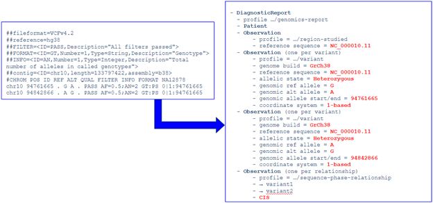
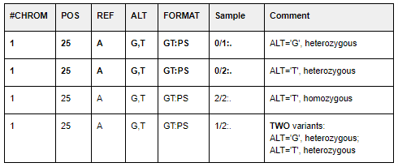
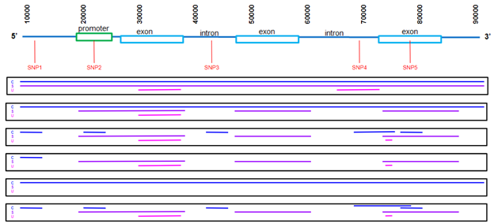

vcf2fhir Manual
===================

Introduction
-------------------------


Conceptually, the utility takes a VCF as input and outputs a FHIR Genomics report. We currently convert simple variants (SNVs, Indels), along with zygosity and phase relationships, for autosomes, sex chromosomes, and mitochondrial DNA, as illustrated here:

<br/>

   

-   **Input**:

    -   **VCF file** (required): Path to a text-based or bgzipped VCF file.

    -   **Tabix file** (required if VCF file is bgzipped): Path to tabix index of VCF file.

    -   **Genome build** (required): Must be one of 'GRCh37' or 'GRCh38'.

    -   **Patient ID** (required): Supplied patient ID is inserted into generated FHIR output.

    -   **Conversion region** (optional): VCF region(s) to convert.

    -   **Studied region** (optional): Genomic regions that have been studied by the lab.

    -   **Noncallable region** (optional): Subset of studied region(s) that are deemed uncallable by the lab.

-   **Output**:

    -  [FHIR Genomics Diagnostic Report](http://hl7.org/fhir/uv/genomics-reporting/index.html "FHIR Genomics Diagnostic Report") (in JSON format) that contains converted variants.

Conversion logic
================

Conversion region
-----------------

Simple variants (SNVs, Indels), along with zygosity and phase
relationships, for autosomes, sex chromosomes, and mitochondrial DNA, are converted into FHIR format. Conversion can be limited to a subset of VCF records using the optional conversion region, studied region, and noncallable region parameters. The following table summarizes the scope
of VCF records converted based on these regions.

| Conversion Region      | Studied Region | Noncallable Region     |  Output     |
| :---:        |    :----:   |          :---: |  :---       |
| Not Supplied      | Not Supplied       | Not Supplied   | <ul><li>Convert all variants in VCF</li><li>FHIR report contains no region-studied observation</li></ul>            |
| Not Supplied      | Not Supplied       | Supplied   | <ul><li>ERROR</li></ul>            |
| Not Supplied      | Supplied       | Not Supplied   | <ul><li>Convert all variants in VCF</li><li>FHIR report contains one region-studied observation per studied chromosome.</li><ul><li>Studied region(s) reflected in ranges-examined component(s)</li></ul></ul>            |
| Not Supplied      | Supplied       |  Supplied   | <ul><li>Convert all variants in VCF</li><li>FHIR report contains one region-studied observation per studied chromosome.</li><ul><li>Studied region(s) reflected in ranges-examined component(s)</li><li>Noncallable region(s) reflected in uncallable-region component(s)</li></ul></ul>            |
|  Supplied      | Not Supplied       |  Not Supplied   | <ul><li>Convert all variants in conversion region</li><li>FHIR report contains no region-studied observation</li></ul>            |
|  Supplied      | Not Supplied       |   Supplied   | <ul><li>ERROR</li></ul>            |
|  Supplied      | Supplied       |  Not Supplied   | <ul><li>Convert all variants in conversion region</li><li>FHIR report contains one region-studied observation per studied chromosome intersected with conversion region</li><ul><li>Studied region(s), intersected with conversion region, reflected in ranges-examined component(s)</li></ul></ul>
|  Supplied      | Supplied       |  Supplied   | <ul><li>Convert all variants in conversion region</li><li>FHIR report contains one region-studied observation per studied chromosome, intersected with conversion region </li><ul><li>Studied region(s), intersected with conversion region, reflected in ranges-examined component(s)</li><li>Noncallable region(s), intersected with conversion region, reflected in uncallable-region component(s)</li></ul></ul>  


General conversion
------------------

### Exclude VCF rows

The following VCF rows are excluded from conversion:

-   VCF REF is not a simple character string

-   VCF ALT is not a simple character string, comma-separated character string, or \'.\'.

-   VCF FILTER does not equal \'PASS\' or \'.\'.

-   VCF INFO.SVTYPE is present. (Structural variants are excluded).

-   VCF FORMAT.GT is null (\'./.\', \'.\|.\', \'.\', etc).

### Create FHIR Diagnostic Report

VCF variants are packaged into a [FHIR Genomics Diagnostic Report](http://hl7.org/fhir/uv/genomics-reporting/index.html):

-   Create a DiagnosticReport that conforms to <http://hl7.org/fhir/uv/genomics-reporting/StructureDefinition/genomics-report>;

-   create unique DiagnosticReport.id;

-   DiagnosticReport.code = LOINC 81247-9 \'Master HL7 genetic variant reporting panel\';

-   DiagnosticReport.subject = patient ID parameter value;

-   DiagnosticReport.issued = date/time of conversion;

-   contains 0..\* RegionStudied observation;

-   contains 0..\* Variant observation;

-   contains 0..\* SequencePhaseRelationship observation;

### Create RegionStudied observations

The scope of RegionStudied observations is described in section
Conversion Region above. For each RegionStudied observation:

-   Create RegionStudied observation that conforms to  <http://hl7.org/fhir/uv/genomics-reporting/StructureDefinition/region-studied>;

-   create unique RegionStudied.id;

-   RegionStudied.status = \'final\';

-   RegionStudied.category = \'laboratory\';

-   RegionStudied.code = LOINC 53041-0 \'DNA region of interest panel\';

-   RegionStudied.subject = patient ID parameter value;

-   RegionStudied.component LOINC 92822-6 \'Genomic coord system\' = LOINC LA30102-0 \'1-based character counting\';

-   RegionStudied.component LOINC 48013-7 \'Genomic reference sequence ID\' = NCBI chromosome-level (\'NC\_\') RefSeq, as determined from GENE and BUILD in filename;

-   Include RegionStudied.component LOINC 51959-5 \'Range(s) of DNA sequence examined\' as described in Conversion Region section above.

-   Include RegionStudied.component \'uncallable-region\' as described in Conversion Region section above.

### Create Variant observations

Create a Variant observation for each non-excluded VCF row.

-   Create 0..\* Variant observations, one for each VCF row, conforming to <http://hl7.org/fhir/uv/genomics-reporting/StructureDefinition/variant>;

-   create unique Variant.id;

-   Variant.status = \'final\';

-   Variant.category = \'laboratory\';

-   Variant.code = LOINC 69548-6 \'Genetic variant assessment\';

-   Variant.subject = patient ID parameter value;

-   Variant.valueCodeableConcept = LOINC LA9633-4 \'present\';

-   Variant.component LOINC 62374-4 \'Human reference sequence assembly version\' = GRCh37 or GRCh38, as determined from parameter value;

-   Variant.component LOINC 48013-7 \'Genomic reference sequence ID\' = NCBI chromosome-level (\'NC\_\') RefSeq, as determined from genome build and VCF \#CHROM.

-   Variant.component LOINC 69547-8 \'Genomic Ref allele \[ID\]\' = VCF REF;

-   Variant.component LOINC 92822-6 \'Genomic coord system\' = LOINC LA30102-0 \'1-based character counting\';

-   Variant.component \'Variant exact start and end\' = VCF POS

-   Variant.component LOINC 53034-5 \'Allelic state\' and Variant.component LOINC 69551-0 \'Genomic Alt allele \[ID\]\' (the following rules apply to autosomes. See below for sex chromosome and mitochondrial DNA conversion):

    -   If VCF ALT is single character then set ALT=VCF ALT

    -   If VCF ALT is \'.\' or if FORMAT.GT is \'0/0\', \'0\|0\'\' then set ALT=REF

    -   If FORMAT.GT is x/x (e.g. 0/0, 1\|1): allelic state = homozygous

    -   If FORMAT.GT is x/y (e.g. 0/1, 1/0, 1\|0): allelic state = heterozygous

    -   If VCF ALT is comma-separated list:

        -   If FORMAT.GT is n/0, n\|0, 0/n, 0\|n where n\>1: set ALT to the nth position in the ALT field, and set allelic state = heterozygous

        -   If FORMAT.GT is n/n, n\|n where n\>1: set ALT to the nth position in the ALT field, and set allelic state = homozygous

        -   If FORMAT.GT is n/m, n\|m where n\>1 and m\>1: There are TWO variants. The first is the nth position in the ALT field, and the second is the mth position in the ALT field. Both are heterozygous. 
        
            

### Create SequencePhaseRelationship observations

Create a SequencePhaseRelationship for every pairwise relationship
asserted in VCF.

-   Create 0..\* SequencePhaseRelationship observations, one for each relationship in the VCF, conforming to <http://hl7.org/fhir/uv/genomics-reporting/StructureDefinition/sequence-phase-relationship>

-   create unique SequencePhaseRelationship.id;

-   SequencePhaseRelationship.status = \'final\';

-   SequencePhaseRelationship.category = \'laboratory\';

-   SequencePhaseRelationship.code = LOINC 82120-7 \'Allelic phase\';

-   SequencePhaseRelationship.subject = patient ID in filename;

-   2..2 SequencePhaseRelationship.derivedFrom = pointer to Variant in a relationship;

-   SequencePhaseRelationship.valueCodeableConcept = \[Cis\|Trans\]:

    -   Identify rows where FORMAT.PS is numeric, where FORMAT.GT contains "\|", and where FORMAT.GT is x\|y (e.g. 0\|1 or 1\|0)

        -   Order rows by FORMAT.PS, by POS

        -   Where \> 1 row have same FORMAT.PS

            -   Beginning with the 2nd row, create a sequence-phase relationship, linking it to the prior row. If x\|y and y\|x then allelic phase is \'Trans\'; if x\|y and x\|y then allelic phase is \'Cis\'.

                -   Examples

                    -   Heterozygous variants are TRANS:\
                         6 18142205 . C T . . . GT:PS 1\|0:18142205\
                         6 18142422 . A C . . . GT:PS 0\|1:18142205

                    -   Heterozygous variants are CIS:\
                        6 18142289 . A G . . . GT:PS 1\|0:18142289\
                        6 18142308 . A G . . . GT:PS 1\|0:18142289

Sex chromosome conversion
-------------------------

-   Software assumes that pseudoautosomal regions (PAR) of chrY are masked, as described by [1000 Genomes](ftp://ftp.ncbi.nih.gov/1000genomes/ftp/technical/reference/phase2_reference_assembly_sequence/README_human_reference_20110707). As a result, we expect to see in VCFs:

    -   Males:

        -   PAR chrX: diploid calls

        -   PAR chrY: no calls

        -   Non-PAR chrX: haploid calls

        -   Non-PAR chrY: haploid calls

    -   Females:

        -   PAR chrX: diploid calls

        -   PAR chrY: no calls

        -   Non-PAR chrX: diploid calls

        -   Non-PAR chrY: no calls

-   For diploid calls (FORMAT.GT has 2 alleles), convert as above for autosomes.

-   For haploid calls (FORMAT.GT has 1 allele)

    -   If VCF ALT is single character then set ALT=VCF ALT

    -   If VCF ALT is \'.\' or if FORMAT.GT is \'0\' then set ALT=REF

    -   If VCF ALT is a comma-separated list, then set ALT to correspond to FORMAT.GT (e.g. if FORMAT.GT is 3, then set ALT to 3rd value in list)

    -   Allelic state is hemizygous

-   Software does not report errors if expected haploid/diploid patterns are violated based on a patient\'s sex.

Mitochondrial DNA conversion
----------------------------

-   We assume NC_012920.1 for both GRCh37\' and GRCh38.

-   If FORMAT.GT is anything other than haploid, do not include in FHIR, but include in invalidrecord log.

-   If VCF ALT is \'.\' or if FORMAT.GT is \'0\', then do not output a variant in FHIR.

-   If VCF ALT is single character then set ALT=VCF ALT

-   If VCF ALT is a comma-separated list, then set ALT to correspond to FORMAT.GT (e.g. if FORMAT.GT is 3, then set ALT to 3rd value in list)

-   Allelic state is based on FORMAT.AD (allelic depth) / FORMAT.DP (read depth) ratio. If AD/DP ratio \> 99% then homoplasmic; else heteroplasmic. \[If AD and DP not present, don\'t output allelic state\]

Parameters
==========

-   **vcf_filename** (required): Path to a text-based or bgzipped VCF file. Valid path and filename without whitespace must be provided. VCF file must conform to VCF Version 4.1 or later. FORMAT.GT must be present. Multi-sample VCFs are allowed, but only the first sample will be converted.

-   **has_tabix** (required if VCF file is bgzipped): Set to \'True\' if there is a tabix index. Tabix file must have the same name as the bgzipped VCF file, with a \'.tbi\' extension, and must be in the same folder.

-   **ref_build** (required): Genome Reference Consortium genome assembly to which variants in the VCF were called. Must be one of \'GRCh37\' or \'GRCh38\'.

-   **patient_id** (required): Supplied patient ID is inserted into generated FHIR output. Alphanumeric string without whitespace.

-   **Conversion region** (optional): Subset of the VCF file to be converted into FHIR. If absent, the entire VCF file is converted. Can be supplied as either a parameter (conv_region_dict) or as a BED file (conv_region_filename):

    -   **conv_region_dict**: Array of regions (e.g. \'{\"Chromosome\": \[\"X\", \"X\", \"M\"\],\"Start\": \[50001, 55001, 50001\],\"End\": \[52001, 60601, 60026\]}\'). Values for Chromosome must align with values in VCF \#CHROM field. Ranges must be [0-based](https://www.biostars.org/p/84686/) (or \'0-start, half-open) and based on GRCh37 or GRCh38 reference sequences.

    -   **conv_region_filename**: Valid path and filename without whitespace must be provided. Must be a valid BED file with first 3 columns: \<chr\> \<start\> \<stop\>. Values in \<chr\> field must align with values in VCF \#CHROM field. Ranges must be based on GRCh37 or GRCh38 reference sequences. Note that BED files are [0-based](https://www.biostars.org/p/84686/) (or \'0-start, half-open) whereas VCF files and FHIR output are 1-based (or 1-start, fully-closed).

-   **region_studied_filename** (optional): Subset of patient\'s genome that was studied in the generation of the VCF file. Valid path and filename without whitespace must be provided. Must be a valid BED file, with first 3 columns: \<chr\> \<start\> \<stop\>. Values in  \<chr\> field must align with values in VCF \#CHROM field. Ranges must be based on GRCh37 or GRCh38 reference sequences. Note that BED files are [[0-based]{.ul}](https://www.biostars.org/p/84686/) (or \'0-start, half-open) whereas VCF files and FHIR output are 1-based (or 1-start, fully-closed).

-   **nocall_filename** (optional): Subset of studied region that is deemed noncallable. Valid path and filename without whitespace must be provided. Must be a valid BED file, with first 3 columns: \<chr\> \<start\> \<stop\>. Values in \<chr\> field must align with values in VCF \#CHROM field. Ranges must be based on GRCh37 or GRCh38 reference sequences. Note that BED files are [0-based](https://www.biostars.org/p/84686/) (or \'0-start, half-open) whereas VCF files and FHIR output are 1-based (or 1-start, fully-closed).

Examples
========

Conversion region examples
--------------------------

The following six cases represent different combinations of regions
(conversion region in blue, studied region in purple, uncallable region
in magenta).

-   Case 1: WGS performed. Convert everything. Scattered uncallable regions.

-   Case 2: WES performed. Convert everything. Scattered uncallable regions.

-   Case 3: WES performed. Convert selected regions. Scattered uncallable regions.

-   Case 4: WES performed. Convert single region. Scattered uncallable regions.

-   Case 5: Unknown studied region. Convert everything. Unknown uncallable regions.

-   Case 6: WES performed. Convert selected regions. Scattered uncallable regions.

       

| Conversion region(s) | Studied region(s) | Uncallable region(s)     | Region-studied observation                       |
| :---: | :---: | :---: | :--- |
| 10000-90000          | 10000-90000 (WGS) | 30000-36000;<br/> 65000-72000 | <ul><li>Convert all variants in Conversion Region</li><li>FHIR report contains a region-studied observation with components:<ul><li>ranges-examined: 10000-90000</li><li>uncallable-region: 30000-36000; 65000-72000</li></ul></li></ul> |
| 10000-90000          | 18000-37000; <br/>46000-58000; <br/>71000-83000 (WES)  | 30000-36000 | <ul><li>Convert all variants in conversion region</li><li>FHIR report contains a region-studied observation with components:<ul><li>ranges-examined: 18000-37000; 46000-58000; 71000-83000</li><li>uncallable-region: 30000-36000</li></ul></li></ul> |
| 10000-12000;<br/> 20000-22000;<br/> 41000-43000;<br/> 68000-73000; <br/>75000-80000      | 18000-37000;<br/> 46000-58000;<br/> 30000-36000;<br/> 71500-72000  | 30000-36000   | <ul><li>Convert all variants in conversion region</li><li>FHIR report contains a region-studied observation with components:<ul><li>ranges-examined: 20000-22000; 71000-73000; 75000-80000 </li><li>uncallable-region: 71500-72000</li></ul></li></ul>            |
| 10000-12000      | 118000-37000;<br/> 46000-58000; <br/>71000-83000 (WES)  | 71500-72000 |<ul><li>Convert all variants in conversion region</li><li>FHIR report contains no region-studied observation  |
| 10000-90000    | Not supplied | Not supplied  |<ul><li>Convert all variants in conversion region</li><li>FHIR report contains no region-studied observation</li></ul>  |
| 10000-12000;<br/> 20000-22000; <br/>41000-43000;<br/> 68000-76000;<br/> 75000-80000    |  18000-37000; 46000-58000; 71000-83000 (WES)   | 71500-72000  | <ul><li>Convert all variants in conversion region</li><li>FHIR report contains a region-studied observation with components:<ul><li>ranges-examined: 20000-22000; 71000-80000</li><li>uncallable-region: 71500-72000</li></ul></li></ul>|

Conversion Examples
===================
- Converts all variants in VCF. FHIR report contains no region-studied observation. 
```
vcf2fhir.Converter('vcftests.vcf','GRCh37', 'aabc')
```
- Submitting only noncallable region without other regions generates an error. 
```
vcf2fhir.Converter('vcftests.vcf','GRCh37', 'babc', nocall_filename='WGS_b37_region_noncallable.bed')
```
- Converts all variants in VCF. FHIR report contains one region-studied observation per studied chromosome.
```
vcf2fhir.Converter('vcftests.vcf','GRCh37', 'cabc', region_studied_filename='WGS_b37_region_studied.bed')
```
- Converts all variants in VCF. FHIR report contains one region-studied observation per studied chromosome.
```
vcf2fhir.Converter('vcftests.vcf','GRCh37', 'dabc', region_studied_filename='WGS_b37_region_studied.bed', nocall_filename='WGS_b37_region_noncallable.bed')
```
- Converts all variants in conversion region. FHIR report contains no region-studied observation.
```
vcf2fhir.Converter('vcftests.vcf','GRCh37', 'eabc', conv_region_filename='WGS_b37_convert_everything.bed')
```
- Submitting only noncallable region without other regions generates an error. 
```
vcf2fhir.Converter('vcftests.vcf','GRCh37', 'fabc', conv_region_filename='WGS_b37_convert_everything.bed', nocall_filename='WGS_b37_region_noncallable.bed')
```
- Converts all variants in conversion region. FHIR report contains one region-studied observation per studied chromosome, intersected with conversion region.
```
vcf2fhir.Converter('vcftests.vcf','GRCh37', 'gabc', conv_region_filename='WGS_b37_convert_everything.bed', region_studied_filename='WGS_b37_region_studied.bed')
```
- Converts all variants in conversion region. FHIR report contains one region-studied observation per studied chromosome, intersected with conversion region.
```
vcf2fhir.Converter('vcftests.vcf','GRCh37', 'habc', conv_region_filename='WGS_b37_convert_everything.bed', region_studied_filename='WGS_b37_region_studied.bed', nocall_filename='WGS_b37_region_noncallable.bed')
```
- Conversion of a bgzipped VCF
```
k=vcf2fhir.Converter('vcf_example4.vcf.gz','GRCh37', 'kabc', has_tabix=True)
```
