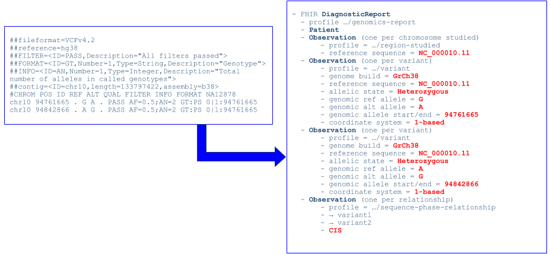

vcf2fhir Manual
===================

Introduction
-------------------------

Conceptually, the utility takes a VCF as input and outputs a FHIR Genomics report. We currently convert simple variants (SNVs, Indels), along with zygosity and phase relationships, for autosomes, sex chromosomes, and mitochondrial DNA, as illustrated here:

 

   

Conversion logic
================

Conversion region
-----------------

Simple variants (SNVs, Indels), along with zygosity and phase
relationships, for autosomes, sex chromosomes, and mitochondrial DNA, are converted into FHIR format. Conversion can be limited to a subset of VCF records using the optional conversion region, studied region, and noncallable region parameters. The following table summarizes the scope
of VCF records converted based on these regions.

| Conversion Region      | Studied Region | Noncallable Region     |  Output     |
| :---:        |    :----:   |          :---: |  :---       |
| Not Supplied      | Not Supplied       | Not Supplied   | <ul><li>Convert all variants in VCF</li><li>FHIR report contains no region-studied observation</li></ul>            |
| Not Supplied      | Not Supplied       | Supplied   | <ul><li>ERROR</li></ul>            |
| Not Supplied      | Supplied       | Not Supplied   | <ul><li>Convert all variants in VCF</li><li>FHIR report contains one region-studied observation per studied chromosome.</li><ul><li>Studied region(s) reflected in ranges-examined component(s)</li></ul></ul>            |
| Not Supplied      | Supplied       |  Supplied   | <ul><li>Convert all variants in VCF</li><li>FHIR report contains one region-studied observation per studied chromosome.</li><ul><li>Studied region(s) reflected in ranges-examined component(s)</li><li>Noncallable region(s) reflected in uncallable-region component(s)</li></ul></ul>            |
|  Supplied      | Not Supplied       |  Not Supplied   | <ul><li>Convert all variants in conversion region</li><li>FHIR report contains no region-studied observation</li></ul>            |
|  Supplied      | Not Supplied       |   Supplied   | <ul><li>ERROR</li></ul>            |
|  Supplied      | Supplied       |  Not Supplied   | <ul><li>Convert all variants in conversion region</li><li>FHIR report contains one region-studied observation per studied chromosome intersected with conversion region</li><ul><li>Studied region(s), intersected with conversion region, reflected in ranges-examined component(s)</li></ul></ul>
|  Supplied      | Supplied       |  Supplied   | <ul><li>Convert all variants in conversion region</li><li>FHIR report contains one region-studied observation per studied chromosome, intersected with conversion region </li><ul><li>Studied region(s), intersected with conversion region, reflected in ranges-examined component(s)</li><li>Noncallable region(s), intersected with conversion region, reflected in uncallable-region component(s)</li></ul></ul>  

General conversion
------------------

### Exclude VCF rows

The following VCF rows are excluded from conversion:

-   VCF REF is not a simple character string

-   VCF ALT is not a simple character string, comma-separated character string, or \'.\'.

-   VCF FILTER does not equal \'PASS\' or \'.\'.

-   VCF INFO.SVTYPE is present. (Structural variants are excluded).

-   VCF FORMAT.GT is null (\'./.\', \'.\|.\', \'.\', etc).

### Create FHIR Diagnostic Report

VCF variants are packaged into a [FHIR Genomics Diagnostic Report](http://hl7.org/fhir/uv/genomics-reporting/index.html):

-   Create a DiagnosticReport that conforms to <http://hl7.org/fhir/uv/genomics-reporting/StructureDefinition/genomics-report>;

-   create unique DiagnosticReport.id;

-   DiagnosticReport.code = LOINC 81247-9 \'Master HL7 genetic variant reporting panel\';

-   DiagnosticReport.subject = patient ID parameter value;

-   DiagnosticReport.issued = date/time of conversion;

-   contains 0..\* RegionStudied observation;

-   contains 0..\* Variant observation;

-   contains 0..\* SequencePhaseRelationship observation;

### Create RegionStudied observations

The scope of RegionStudied observations is described in section
Conversion Region above. For each RegionStudied observation:

-   Create RegionStudied observation that conforms to  <http://hl7.org/fhir/uv/genomics-reporting/StructureDefinition/region-studied>;

-   create unique RegionStudied.id;

-   RegionStudied.status = \'final\';

-   RegionStudied.category = \'laboratory\';

-   RegionStudied.code = LOINC 53041-0 \'DNA region of interest panel\';

-   RegionStudied.subject = patient ID parameter value;

-   RegionStudied.component LOINC 92822-6 \'Genomic coord system\' = LOINC LA30102-0 \'1-based character counting\';

-   RegionStudied.component LOINC 48013-7 \'Genomic reference sequence ID\' = NCBI chromosome-level (\'NC\_\') RefSeq, as determined from BUILD in filename;

-   Include RegionStudied.component LOINC 51959-5 \'Range(s) of DNA sequence examined\' as described in Conversion Region section above.

-   Include RegionStudied.component \'uncallable-region\' as described in Conversion Region section above.

### Create Variant observations

Create a Variant observation for each non-excluded VCF row.

-   Create 0..\* Variant observations, one for each VCF row, conforming to <http://hl7.org/fhir/uv/genomics-reporting/StructureDefinition/variant>;

-   create unique Variant.id;

-   Variant.status = \'final\';

-   Variant.category = \'laboratory\';

-   Variant.code = LOINC 69548-6 \'Genetic variant assessment\';

-   Variant.subject = patient ID parameter value;

-   Variant.valueCodeableConcept = LOINC LA9633-4 \'present\';

-   Variant.component LOINC 62374-4 \'Human reference sequence assembly version\' = GRCh37 or GRCh38, as determined from parameter value;

-   Variant.component LOINC 48013-7 \'Genomic reference sequence ID\' = NCBI chromosome-level (\'NC\_\') RefSeq, as determined from genome build and VCF \#CHROM.

-   Variant.component LOINC 69547-8 \'Genomic Ref allele \[ID\]\' = VCF REF;

-   Variant.component LOINC 92822-6 \'Genomic coord system\' = LOINC LA30102-0 \'1-based character counting\';

-   Variant.component \'Variant exact start and end\' = VCF POS

-   Variant.component LOINC 53034-5 \'Allelic state\' and Variant.component LOINC 69551-0 \'Genomic Alt allele \[ID\]\' (the following rules apply to autosomes. See below for sex chromosome and mitochondrial DNA conversion):

    -   If VCF ALT is single character then set ALT=VCF ALT

    -   If VCF ALT is \'.\' or if FORMAT.GT is \'0/0\', \'0\|0\'\' then set ALT=REF

    -   If FORMAT.GT is x/x (e.g. 0/0, 1\|1): allelic state = homozygous

    -   If FORMAT.GT is x/y (e.g. 0/1, 1/0, 1\|0): allelic state = heterozygous

    -   If VCF ALT is comma-separated list:

        -   If FORMAT.GT is n/0, n\|0, 0/n, 0\|n where n\>1: set ALT to the nth position in the ALT field, and set allelic state = heterozygous

        -   If FORMAT.GT is n/n, n\|n where n\>1: set ALT to the nth position in the ALT field, and set allelic state = homozygous

        -   If FORMAT.GT is n/m, n\|m where n\>1 and m\>1: There are TWO variants. The first is the nth position in the ALT field, and the second is the mth position in the ALT field. Both are heterozygous. 
        
            

### Create SequencePhaseRelationship observations

Create a SequencePhaseRelationship for every pairwise relationship
asserted in VCF.

-   Create 0..\* SequencePhaseRelationship observations, one for each relationship in the VCF, conforming to <http://hl7.org/fhir/uv/genomics-reporting/StructureDefinition/sequence-phase-relationship>

-   create unique SequencePhaseRelationship.id;

-   SequencePhaseRelationship.status = \'final\';

-   SequencePhaseRelationship.category = \'laboratory\';

-   SequencePhaseRelationship.code = LOINC 82120-7 \'Allelic phase\';

-   SequencePhaseRelationship.subject = patient ID in filename;

-   2..2 SequencePhaseRelationship.derivedFrom = pointer to Variant in a relationship;

-   SequencePhaseRelationship.valueCodeableConcept = \[Cis\|Trans\]:

    -   Identify rows where FORMAT.PS is numeric, where FORMAT.GT contains "\|", and where FORMAT.GT is x\|y (e.g. 0\|1 or 1\|0)

        -   Order rows by FORMAT.PS, by POS

        -   Where \> 1 row have same FORMAT.PS

            -   Beginning with the 2nd row, create a sequence-phase relationship, linking it to the prior row. If x\|y and y\|x then allelic phase is \'Trans\'; if x\|y and x\|y then allelic phase is \'Cis\'.

                -   Examples

                    -   Heterozygous variants are TRANS:\
                         6 18142205 . C T . . . GT:PS 1\|0:18142205\
                         6 18142422 . A C . . . GT:PS 0\|1:18142205

                    -   Heterozygous variants are CIS:\
                        6 18142289 . A G . . . GT:PS 1\|0:18142289\
                        6 18142308 . A G . . . GT:PS 1\|0:18142289

Sex chromosome conversion
-------------------------

-   Sex chromosome conversion translates chrX and chrY calls as they exist in the VCF. Many VCF calling pipelines mask the pseudoautosomal regions (PAR) of chrY, as described by [1000 Genomes](http://ftp.ncbi.nih.gov/1000genomes/ftp/technical/reference/phase2_reference_assembly_sequence/README_human_reference_20110707). As a result, we commonly see in VCFs:

    -   Males:

        -   PAR chrX: diploid calls

        -   PAR chrY: no calls

        -   Non-PAR chrX: haploid calls

        -   Non-PAR chrY: haploid calls

    -   Females:

        -   PAR chrX: diploid calls

        -   PAR chrY: no calls

        -   Non-PAR chrX: diploid calls

        -   Non-PAR chrY: no calls

-   For diploid calls (FORMAT.GT has 2 alleles), convert as above for autosomes.

-   For haploid calls (FORMAT.GT has 1 allele)

    -   If VCF ALT is single character then set ALT=VCF ALT

    -   If VCF ALT is \'.\' or if FORMAT.GT is \'0\' then set ALT=REF

    -   If VCF ALT is a comma-separated list, then set ALT to correspond to FORMAT.GT (e.g. if FORMAT.GT is 3, then set ALT to 3rd value in list)

    -   Allelic state is hemizygous

Mitochondrial DNA conversion
----------------------------

-   We assume NC_012920.1 for both GRCh37\' and GRCh38.

-   If FORMAT.GT is anything other than haploid, do not include in FHIR, but include in invalidrecord log.

-   If VCF ALT is \'.\' or if FORMAT.GT is \'0\', then do not output a variant in FHIR.

-   If VCF ALT is single character then set ALT=VCF ALT

-   If VCF ALT is a comma-separated list, then set ALT to correspond to FORMAT.GT (e.g. if FORMAT.GT is 3, then set ALT to 3rd value in list)

-   Allelic state is based on FORMAT.AD (allelic depth) / FORMAT.DP (read depth) ratio. If AD/DP ratio \> 99% then homoplasmic; else heteroplasmic. \[If AD and DP not present, don\'t output allelic state\]