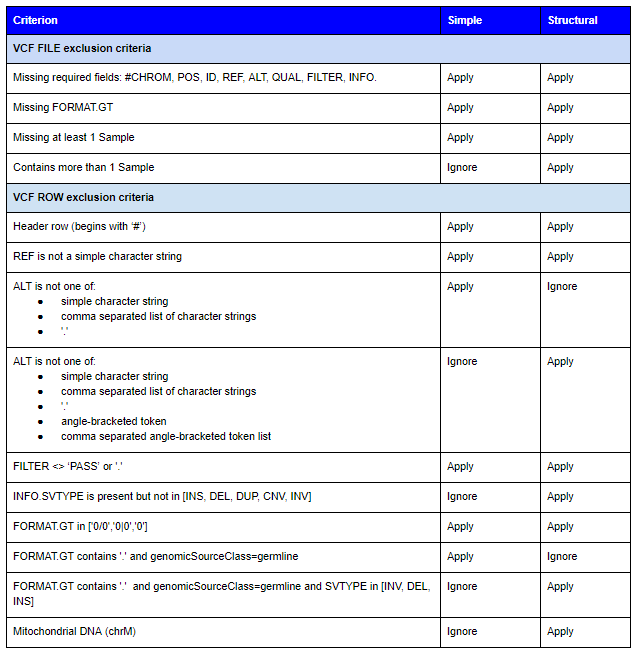
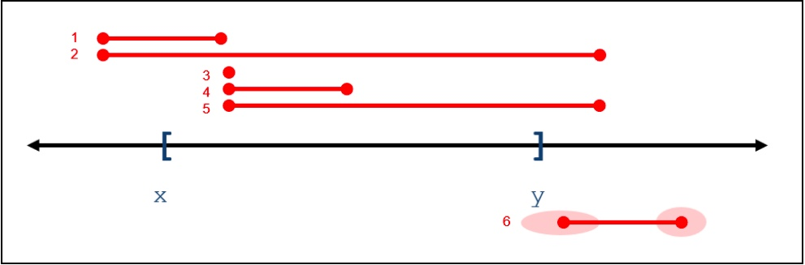

# vcf2fhir Manual

## Introduction

Conceptually, the utility takes a VCF file as input and outputs a FHIR Genomics report. Software converts simple (SNV, MNV, Indel) and structural (CNV, INS, DEL, INV, DUP) variants from VCF to FHIR format. Optional files can also be supplied to limit the conversion region or supplement the FHIR Genomics report with clinical annotations.

 

Conversion logic
================

## Conversion Regions

Variants are converted from VCF into FHIR format. Conversion can be limited to a subset of VCF records by supplying conversion regions, studied regions, clinical annotations, and uncallable regions, as described in the following table.

|**Conversion Regions**|**Studied Regions**|**Uncallable Regions**|**Clinical Annotations**|**Output**|
| :- | :- | :- | :- | :- |
|Not supplied|Not supplied|Not supplied|Not supplied|<ul><li>Convert all variants in VCF</li><li>FHIR report contains no region-studied observation</li></ul>|
|Not supplied|Not supplied|Not supplied|Supplied|<ul><li>Convert variants in VCF-Annotation intersection</li><li>FHIR report contains no region-studied observation</li></ul>|
|Not supplied|Not supplied|Supplied|Not supplied|<ul><li>ERROR</li></ul>|
|Not supplied|Not supplied|Supplied|Supplied|<ul><li>ERROR</li></ul>|
|Not supplied|Supplied|Not supplied|Not supplied|<ul><li>Convert all variants in VCF</li><li>FHIR report contains one region-studied observation per studied chromosome</li><ul><li>Studied region(s) reflected in ranges-examined component(s)</li></ul></ul>|
|Not supplied|Supplied|Not supplied|Supplied|<ul><li>Convert variants in VCF-Annotation intersection</li><li>FHIR report contains one region-studied observation per studied chromosome</li><ul><li>Studied region(s) reflected in ranges-examined component(s)</li></ul></ul>|
|Not supplied|Supplied|Supplied|Not supplied|<ul><li>Convert all variants in VCF</li><li>FHIR report contains one region-studied observation per studied chromosome</li><ul><li>Studied region(s) reflected in ranges-examined component(s)</li><li>Noncallable region(s) reflected in uncallable-region component(s)</li></ul></ul>|
|Not supplied|Supplied|Supplied|Supplied|<ul><li>Convert all variants in VCF-Annotation intersection</li><li>FHIR report contains one region-studied observation per studied chromosome</li><ul><li>Studied region(s) reflected in ranges-examined component(s)</li><li>Noncallable region(s) reflected in uncallable-region component(s)</li></ul></ul>|
|Supplied|Not supplied|Not supplied|Not supplied|<ul><li>Convert all variants in VCF-Conversion intersection</li><li>FHIR report contains no region-studied observation</li></ul>|
|Supplied|Not supplied|Not supplied|Supplied|<ul><li>Convert variants in VCF-Conversion-Annotation intersection</li><li>FHIR report contains no region-studied observation</li></ul>|
|Supplied|Not supplied|Supplied|Not supplied|<ul><li>ERROR</li></ul>|
|Supplied|Not supplied|Supplied|Supplied|<ul><li>ERROR</li></ul>|
|Supplied|Supplied|Not supplied|Not supplied|<ul><li>Convert all variants in VCF-Conversion intersection</li><li>FHIR report contains one region-studied observation per studied chromosome</li><ul><li>Studied region(s) reflected in ranges-examined component(s)</li></ul></ul>|
|Supplied|Supplied|Not supplied|Supplied|<ul><li>Convert variants in VCF-Conversion-Annotation intersection</li><li>FHIR report contains one region-studied observation per studied chromosome</li><ul><li>Studied region(s) reflected in ranges-examined component(s)</li></ul></ul>|
|Supplied|Supplied|Supplied|Not supplied|<ul><li>Convert all variants in VCF-Conversion intersection</li><li>FHIR report contains one region-studied observation per studied chromosome</li><ul><li>Studied region(s) reflected in ranges-examined component(s)</li><li>Noncallable region(s) reflected in uncallable-region component(s)</li></ul></ul>|
|Supplied|Supplied|Supplied|Supplied|<ul><li>Convert all variants in VCF-Conversion-Annotation intersection</li><li>FHIR report contains one region-studied observation per studied chromosome</li><ul><li>Studied region(s) reflected in ranges-examined component(s)</li><li>Noncallable region(s) reflected in uncallable-region component(s)</li></ul></ul>|

## General conversion

### Simple vs. Structural Variant

- **Simple**: VCF INFO.SVTYPE is not present

- **Structural**: VCF INFO.SVTYPE is present

### Exclude VCF rows

Software excludes the following VCF rows from conversion. 
Note that different exclusion criteria apply to the conversion of simple vs. structural variants.
Note also that correct parsing of VCF INFO and FORMAT subfields requires the presence of corresponding meta-information lines in the VCF header.

### Create FHIR Diagnostic Report

VCF variants are packaged into a [FHIR Genomics Diagnostic Report](http://hl7.org/fhir/uv/genomics-reporting/index.html):

- Create a DiagnosticReport that conforms to <http://hl7.org/fhir/uv/genomics-reporting/StructureDefinition/genomics-report>;

- create unique DiagnosticReport.id;

- DiagnosticReport.code = LOINC 81247-9 'Master HL7 genetic variant reporting panel';

- DiagnosticReport.category = code 'GE' from codeSystem 'http://terminology.hl7.org/CodeSystem/v2-0074'

- DiagnosticReport.subject = patient ID parameter value;

- DiagnosticReport.issued = date/time of conversion;

- contains 0..\* RegionStudied observation;

- contains 0..\* Variant observation;

- contains 0..\* SequencePhaseRelationship observation;

- contains 0..\* DiagnosticImplication observation

### Create RegionStudied observations

The scope of RegionStudied observations is described in section [Conversion Regions](#conversion-regions) above. For each RegionStudied observation:

- Create RegionStudied observation that conforms to <http://hl7.org/fhir/uv/genomics-reporting/StructureDefinition/region-studied>;

- create unique RegionStudied.id;

- RegionStudied.status = 'final';

- RegionStudied.category = 'laboratory';

- RegionStudied.code = LOINC 53041-0 'DNA region of interest panel';

- RegionStudied.subject = patient ID parameter value;

- RegionStudied.component LOINC 92822-6 'Genomic coord system' = LOINC LA30102-0 '1-based character counting';

- RegionStudied.component LOINC 48013-7 'Genomic reference sequence ID' = NCBI chromosome-level ('NC\_') RefSeq, as determined from genome build and VCF CHROM.

- Include RegionStudied.component LOINC 51959-5 'Range(s) of DNA sequence examined' as described in the [Conversion Regions](#conversion-regions) section above.

- Include RegionStudied.component 'uncallable-region' as described in the [Conversion Regions](#conversion-regions) section above.

### Create Variant observations
- Convert variants that intersect (based on VCF's POS and INFO.END) a conversion region. (Note - this will pick up variants 1-5, but will miss 6) (Note - VCF is 1-based whereas BED is zero-based)

- These are the VCF fields used: CHROM, POS, REF, ALT, FILTER, INFO.SVTYPE, INFO.CIPOS, INFO.CIEND, INFO.END, FORMAT.GT, FORMAT.PS, FORMAT.CN, FORMAT.AD, FORMAT.DP
- The FHIR Variant profile is constructed per the following table. (Additional components are populated if an annotation file is supplied - see section '[Create DiagnosticImplication observations](#create-diagnosticimplication-observations)')

|||
| :- | :- |
|\[1..1\] id|<ul><li>create unique id</li></ul>|
|\[1..1\] meta|<ul><li>http://hl7.org/fhir/uv/genomics-reporting/StructureDefinition/variant</li></ul>|
|\[1..1\] status|<ul><li>final</li></ul>|
|\[1..1\] labCategory|<ul><li>laboratory</li></ul>|
|\[1..1\] code|<ul><li>LOINC 69548-6 'Genetic variant assessment';</li></ul>|
|\[1..1\] subject|<ul><li>patient ID parameter value</li></ul>|
|\[1..1\] valueCodeableConcept|<ul><li>"**system**": "http://loinc.org"</li><li>"**code**": " LA9633-4"</li><li>"**display**": "present"</li></ul>|
|\[1..1\] component:dna-chg-type (LOINC 48019-4)|<ul><li>**Simple variants**</li><ul><li>Not populated</li></ul><li>**Structural variants**</li><ul><li>**CNV**: SO:0001019 \| copy_number_variation \| http://sequenceontology.org</li><li>**DUP**: SO:1000035 \| duplication \| http://sequenceontology.org</li><li>**DEL**: SO:0000159 \| deletion \| http://sequenceontology.org</li><li>**INV**: SO:1000036 \| inversion \| http://sequenceontology.org</li><li>**INS**: SO:0000667 \| insertion \| http://sequenceontology.org</li></ul>|
|\[1..1\] component:genomic-ref-seq (LOINC 48013-7)|<ul><li>NCBI chromosome-level ('NC_') RefSeq, as determined from genome build and VCF #CHROM.</li></ul>|
|\[0..1\] component: genomic-source-class (LOINC 48002-0)|<ul><li>See next table</li></ul>|
|\[0..1\] component: allelic-state (LOINC 53034-5)|<ul><li>See next table</li></ul>|
|\[0..1\] component: sample-allelic-frequency (LOINC 81258-6)|<ul><li>See next table</li></ul>|
|\[0..1\] component: copy-number (LOINC 82155-3)|<ul><li>See next table</li></ul>|
|\[1..1\] component: ref-allele (LOINC 69547-8)|<ul><li>= VCF REF</li></ul>|
|\[0..1\] component: alt-allele (LOINC 69551-0)|<ul><li>**Simple variants** (autosomes; see below for sex chromosomes and mitochondrial DNA)</li><ul><li>If VCF ALT is single character then set ALT=VCF ALT</li><li>If VCF ALT is comma-separated list:</li><ul><li>If FORMAT.GT is n/0, n\|0, 0/n, 0\|n where n>1: set ALT to the nth position in the ALT field, and set allelic state = heterozygous</li><li>If FORMAT.GT is n/n, n\|n where n>1: set ALT to the nth position in the ALT field, and set allelic state = homozygous</li><li>If FORMAT.GT is n/m, n\|m where n>1 and m>1: There are TWO variants. The first is the nth position in the ALT field, and the second is the mth position in the ALT field. Both are heterozygous.</li></ul></ul></ul></ul><ul><li>**Structural variants**</li><ul><li>If INFO.SVTYPE is INS and VCF ALT is char string:</li><ul><li> Populate with VCF ALT.</li></ul><li>Else:</li><ul><li>Don't include this component.</li></ul></li></ul>|
|\[1..1\] component: coordinate-system (LOINC 92822-6)|<ul><li>LOINC LA30102-0 \| 1-based character counting</li></ul>|
|\[0..1\] component: exact-start-end (TbdCode exact-start-end) |<ul><li>**Simple variants**</li><ul><li>Exact start = VCF POS</li><li>Exact end is not populated</li></ul><li>**Structural variants**</li><ul><li>Not populated</li></ul></ul>|
|\[0..1\] component: outer-start-end (TbdCode outer-start-end)|<ul><li>**Simple variants**</li><ul><li>Not populated</li></ul><li>**Structural variants**</li><ul><li>If INFO.CIPOS and INFO.CIEND are present:</li><ul><li>Outer start = POS-\|INFO.CIPOS\[0\]\|</li><li>Outer end = INFO.END+INFO.CIEND\[1\]</li></ul><li>Else:</li><ul><li>Don't include outer-start-end</li></ul></ul></ul>|
|\[0..1\] component: inner-start-end (TbdCode inner-start-end)|<ul><li>**Simple variants**</li><ul><li>Not populated</li></ul><li>**Structural variants**</li><ul><li>If INFO.CIPOS and INFO.CIEND are present:</li><ul><li>Inner start = POS+INFO.CIPOS\[1\]</li><li>Inner end = INFO.END-\|INFO.CIEND\[0\]\|</li></ul><li>Else:</li><ul><li>Inner start = POS</li><li>Inner end = INFO.END</li></ul></ul></ul>|

- Rules for populating genomic-source-class, allelic-state, sample-allelic-frequency, copy-number: 

|**parameter - variant type**|**FORMAT.GT**|**genomic source class**|**allelic state**|**allelic frequency**|**copy number**|
| :- | :- | :- | :- | :- | :- |
|**germline - simple**|
exclude if in \['0/0','0\|0','0'\];

exclude if contains '.'
|populate (=germline)|
If FORMAT.GT is x/x (e.g. 1\|1) then allelic state = homozygous; 

If FORMAT.GT is x/y (e.g. 0/1, 1/0, 1\|0) then allelic state = heterozygous
|populate if possible with FORMAT.AD/FORMAT.DP|do not populate|
|**germline - structural (CNV)**|exclude if in \['0/0','0\|0','0'\]|populate (=germline)|do not populate|do not populate|populate if possible with FORMAT.CN|
|**germline - structural (DUP, DEL)\***|exclude if in \['0/0','0\|0','0'\]|populate (=germline)|populate if possible based on FORMAT.GT (heterozygous, homozygous, hemizygous)|do not populate|populate if possible with FORMAT.CN|
|**germline - structural (INV, INS)**|
exclude if in \['0/0','0\|0','0'\];

exclude if contains '.'
|populate (=germline)|populate if possible based on FORMAT.GT (heterozygous, homozygous, hemizygous)|do not populate|do not populate|
|**somatic - simple**|exclude if in \['0/0','0\|0','0'\]|populate (=somatic)|do not populate|populate if possible with FORMAT.AD/FORMAT.DP|do not populate|
|**somatic - structural (CNV)**|exclude if in \['0/0','0\|0','0'\]|populate (=somatic)|do not populate|do not populate|populate if possible with FORMAT.CN|
|**somatic - structural (DUP, DEL)\***|exclude if in \['0/0','0\|0','0'\]|populate (=somatic)|do not populate|do not populate|populate if possible with FORMAT.CN|
|**somatic - structural (INV, INS)**|exclude if in \['0/0','0\|0','0'\]|populate (=somatic)|do not populate|do not populate|do not populate|
|**null or mixed - simple**|exclude if in \['0/0','0\|0','0'\]|do not populate|do not populate|populate if possible with FORMAT.AD/FORMAT.DP|do not populate|
|**null or mixed - structural (CNV)**|exclude if in \['0/0','0\|0','0'\]|do not populate|do not populate|do not populate|populate if possible with FORMAT.CN|
|**null or mixed - structural (DUP, DEL)\***|exclude if in \['0/0','0\|0','0'\]|do not populate|do not populate|do not populate|populate if possible with FORMAT.CN|
|**null or mixed - structural (INV, INS)**|exclude if in \['0/0','0\|0','0'\]|do not populate|do not populate|do not populate|do not populate|

\*DEL/DUP claims made by breakpoint callers (e.g. Delly) generally report allelic state and/or allelic frequency, whereas DEL/DUP claims made by abundance callers (e.g. CNVnator) generally report copy number. Software currently translates FORMAT.GT, FORMAT.AD/FORMAT.DP and FORMAT.CN for all DEL and DUPs.

### Create SequencePhaseRelationship observations

Create a SequencePhaseRelationship for every pairwise relationship asserted in VCF.

- Create 0..\* SequencePhaseRelationship observations, one for each relationship in the VCF, conforming to <http://hl7.org/fhir/uv/genomics-reporting/StructureDefinition/sequence-phase-relationship>

- create unique SequencePhaseRelationship.id;

- SequencePhaseRelationship.status = 'final';

- SequencePhaseRelationship.category = 'laboratory';

- SequencePhaseRelationship.code = LOINC 82120-7 'Allelic phase';

- SequencePhaseRelationship.subject = patient ID in filename;

- 2..2 SequencePhaseRelationship.derivedFrom = pointer to Variant in a relationship;

- SequencePhaseRelationship.valueCodeableConcept = \[Cis\|Trans\]:

  - Identify rows where FORMAT.PS is numeric, where FORMAT.GT contains "\|", and where FORMAT.GT is x|y (e.g. 0\|1 or 1\|0)

    - Order rows by FORMAT.PS, by POS

    - Where > 1 row have same FORMAT.PS

      - Beginning with the 2nd row, create a sequence-phase relationship, linking it to the prior row. If x|y and y|x then allelic phase is 'Trans'; if x|y and x|y then allelic phase is 'Cis'.

        - Examples

          - Heterozygous variants are TRANS:

            6 18142205 . C T . . . GT:PS 1\|0:18142205

            6 18142422 . A C . . . GT:PS 0\|1:18142205

          - Heterozygous variants are CIS:

            6 18142289 . A G . . . GT:PS 1\|0:18142289

            6 18142308 . A G . . . GT:PS 1\|0:18142289

### Create DiagnosticImplication observations

Where clinical annotations are supplied, the software will generate DiagnosticImplication observations and will add additional components to the Variant observation. The following annotations are supported: 

- **gene** (code^symbol^codeSystem): Gene containing the annotated variant. Default value is 'HGNC:0000^NoGene^HGNC'. 

- **transcriptRefSeq** (STRING): Valid transcript reference sequence identifier (e.g.  'NM\_001354609.2')

- **cHGVS** (STRING): Valid c.HGVS expression, minus the reference sequence prefix (e.g. 'c.1799\_1800delinsAA')

- **proteinRefSeq** (STRING): Valid protein reference sequence identifier (e.g. 'NP\_001341538.1')

- **pHGVS** (STRING): Valid p.HGVS expression, minus the reference sequence prefix (e.g. 'p.V600E')

- **clinSig** (STRING): An indication of the clinical significance of the variant. Suggested values are those used by ClinVar, listed here.

- **phenotype** (code^symbol^codeSystem): The (coded) condition or phenotype associated with this variant.

Annotations are supplied in a tab-delimited file. Columns 1-4 are **CHROM**, **POS**, **REF**, **ALT**, and must match a row in the VCF. Columns 5-11 are **gene**, **transcriptRefSeq**, **cHGVS**, **proteinRefSeq**, **pHGVS**, **clinSig**, **phenotype**. All columns must be present. Columns 1-4 must be populated. Columns 5-11 can contain nulls.

**Sample annotation file:**

|**CHROM**|**POS**|**REF**|**ALT**|**gene**|**transcriptRefSeq**|**cHGVS**|**proteinRefSeq**|**pHGVS**|**clinSig**|**phenotype**|
| :- | :- | :- | :- | :- | :- | :- | :- | :- | :- | :- |
|chr5|112841059|T|A|HGNC:583^APC^HGNC|NM_001127510.3|c.5465T>A||p.Val1822Asp|Benign|72900001^Familial multiple polyposis syndrome^SCT|
|chr11|47348490|T|C|HGNC:7551^MYBPC3^HGNC|NM_000256.3|c.706A>G||p.Ser236Gly|Likely benign|35728003^Familial cardiomyopathy^SCT|
|chr11|64804546|T|C|HGNC:7010^MEN1^HGNC|NM_130800.2|c.1516A>G||p.Thr506Ala|Benign|30664006^Multiple endocrine neoplasia, type 1^SCT|
|chr13|32355250|T|C|HGNC:1101^BRCA2^HGNC|NM_000059.4|c.7397T>C||p.Val2466Ala|Benign|718220008^Hereditary breast and ovarian cancer syndrome^SCT|
|chr19|38499670|C|T|HGNC:10483^RYR1^HGNC|NM_001042723.2|c.7063C>T||p.Arg2355Trp|Pathogenic|405501007^Malignant hyperthermia^SCT|

**Conversion logic:**

- Enhance the Variant observation

  - variant.component.transcript-ref-seq: populate with transcriptRefSeq

  - variant.component.dna-chg: populate with cHGVS

  - variant.component.amino-acid-chg: populate with proteinRefSeq and pHGVS

- Create DiagnosticImplication observations

  - derivedFrom: link to variant observation

  - diagnosticImplication.component.component.clinical-significance: populate with clinSig

  - diagnosticImplication.component.associated-phenotype: populate with phenotype

### Sex chromosome conversion

- Sex chromosome conversion translates chrX and chrY calls as they exist in the VCF. Many VCF calling pipelines mask the pseudoautosomal regions (PAR) of chrY, as described by [1000 Genomes](http://ftp.ncbi.nih.gov/1000genomes/ftp/technical/reference/phase2_reference_assembly_sequence/README_human_reference_20110707). As a result, we commonly see in VCFs:

  - Males:

    - PAR chrX: diploid calls

    - PAR chrY: no calls

    - Non-PAR chrX: haploid calls

    - Non-PAR chrY: haploid calls

  - Females:

    - PAR chrX: diploid calls

    - PAR chrY: no calls

    - Non-PAR chrX: diploid calls

    - Non-PAR chrY: no calls

- For diploid calls (FORMAT.GT has 2 alleles), convert as above for autosomes.

- For haploid calls (FORMAT.GT has 1 allele)

  - If VCF ALT is single character then set ALT=VCF ALT

  - If VCF ALT is '.' or if FORMAT.GT is '0' then set ALT=REF

  - If VCF ALT is a comma-separated list, then set ALT to correspond to FORMAT.GT (e.g. if FORMAT.GT is 3, then set ALT to 3rd value in list)

  - Allelic state is hemizygous

### Mitochondrial DNA conversion

- Software assumes NC\_012920.1 for both GRCh37 and GRCh38.

- If FORMAT.GT is anything other than haploid, do not convert in FHIR, but include in invalidrecord log.

- If VCF ALT is single character then set ALT=VCF ALT

- If VCF ALT is a comma-separated list, then set ALT to correspond to FORMAT.GT (e.g. if FORMAT.GT is 3, then set ALT to 3rd value in list)

- Allelic state is based on FORMAT.AD (allelic depth) / FORMAT.DP (read depth) ratio. Default ratio is 99%, but can be configured using ratio\_ad\_dp parameter. If AD/DP ratio > ratio\_ad\_dp then homoplasmic; else heteroplasmic. [If AD and DP are not present, don't output an allelic state]
